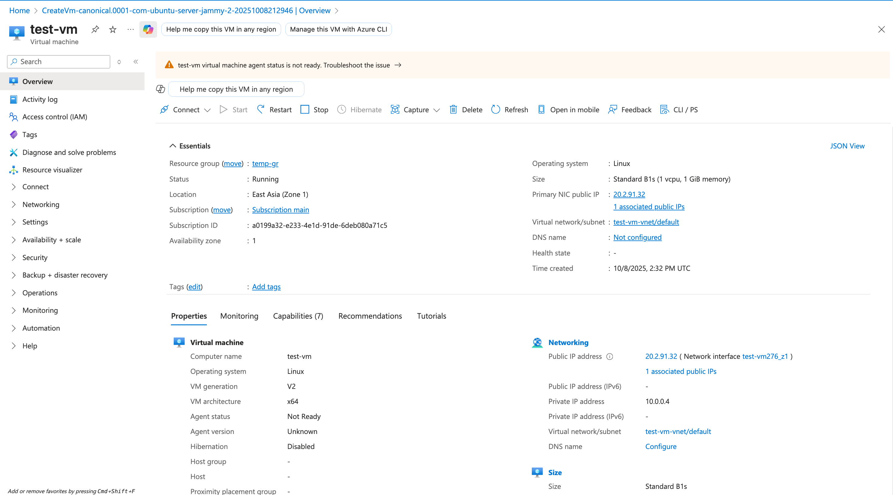

# Overview

- Create the VM to practice and it will be automatically stopped if it is not used for a short time 15mins [Done]
- Basically, the VM will cost the user when the VM having the status running, so it is really useful of we stop the VM when not using. So we can use Automation Account with Runbook to achieve that [Done]
- Create the VM via Azure Portal, CLI, ARM templates [Done]
- Learn how to scale, and try to reproduce [TODO]
- Config VNet, Subnet, Public, IP, and NSGs [TODO]
- Disk & Storage and Snapshots & Backups [TODO]
- Basic Monitoring & Alerts [TODO]
- Basic Automation Deploy and manage VMs using ARM Templates, Bicep, and PowerShell scripts. [TODO]

# =======

# Create the VM and Automation Account to automate stopping the VM

## 1. Create the VM

- VM name: main-running-vm-cost
- Group name: long-running-gr
- Cost: 10–20$ / months

## 2. Set up the Budget to limit the cost

- Maximum 10$ per month for all Azure resource

## 3. Create the Automation Account

- main-running-vm-cost-auto-stop the same region with VM
- Include Runbook within the script to check the CPU and stop VM at the specific condition

## 4. Turn on Managed Identity for Automation Account

## 5. Grant permission Contributor for that Automation Account

az role assignment create \
 --assignee-object-id <ID> \
 --assignee-principal-type ServicePrincipal \
 --role "Contributor" \
 --scope /subscriptions/<Subscription...>/resourceGroups/long-running-gr

## 6. Import necessary module

- Az.Accounts
- Az.Compute
- Az.Monitor
- Az.Resources

## 7. Create Runbook AutoStopIdleVM within the script to check and stop the VM

## 8. Test the Runbook

## 9. Create the scheduler to automate running Runbook

- That will be run every hour

# =======

# Create the VM via CLI, ARM templates

## 1. Create VM via Azure Portal



## 2. Create VM via Azure CLI

- Login

```sh
az login
```

- Create (or reuse) the resource group

```sh
az group create --name temp-gr --location eastasia
```

- Create the second VM

```sh
az vm create \
  --resource-group temp-gr \
  --name test-vm-2 \
  --image Ubuntu2204 \
  --size Standard_B1s \
  --admin-username azureuser \
  --admin-password "azureuser@123" \
  --authentication-type password \
  --zone 1 \
  --public-ip-sku Standard \
  --location eastasia

```

The result could be

```json
{
  "fqdns": "",
  "id": "/subscriptions/a0199a32-e233-4e1d-91de-6deb080a71c5/resourceGroups/temp-gr/providers/Microsoft.Compute/virtualMachines/test-vm-2",
  "location": "eastasia",
  "macAddress": "60-45-BD-55-A9-5C",
  "powerState": "VM running",
  "privateIpAddress": "10.0.0.5",
  "publicIpAddress": "20.2.88.115",
  "resourceGroup": "temp-gr",
  "zones": "1"
}
```

- Open SSH port

```sh
az vm open-port \
  --port 22 \
  --resource-group temp-gr \
  --name test-vm-2
```

- SSH to server

```sh
ssh azureuser@20.2.88.115
```

The result


## 3. Create VM via ARM Template

Create the ARM configuration file `2.vm-template.json`

Run this in Azure CLI

```sh
az group create --name temp-gr --location eastasia

DEPLOY=vm3-$RANDOM

az deployment group validate \
  --resource-group temp-gr \
  --template-file ./scripts/2.vm-template.json \
  --parameters adminPassword="AzureUser@1234" \
  --output json

az deployment group create \
  --name $DEPLOY \
  --resource-group temp-gr \
  --template-file ./scripts/2.vm-template.json \
  --parameters adminPassword="AzureUser@1234" \
  --output json
```

_We can replace validate/create by what-if to see the preview of deployment_

The result


# =======
