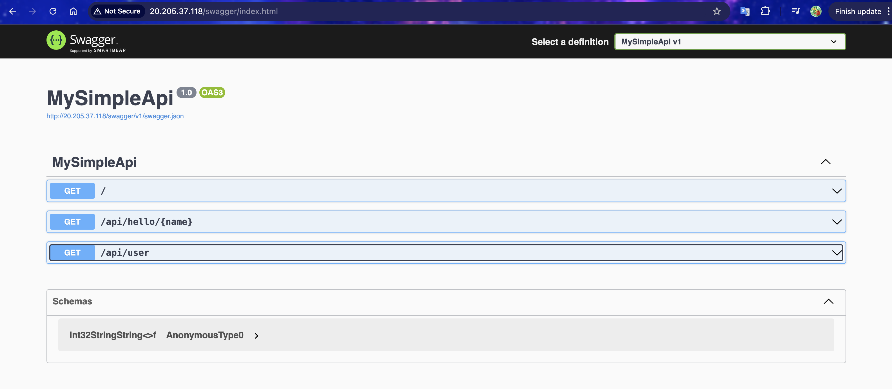
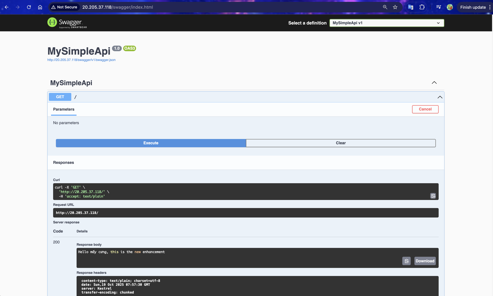

# 1. Set up Dotnet API Application within versioning

- Create Dotnet API Application

```sh
dotnet new webapi -n MySimpleApi
cd MySimpleApi
```

- Update the `Program.cs` file to create the API

```cs
var builder = WebApplication.CreateBuilder(args);

builder.Services.AddEndpointsApiExplorer();
builder.Services.AddSwaggerGen();

var app = builder.Build();

app.UseSwagger();
app.UseSwaggerUI();

app.MapGet("/", () => "Hello from .NET 8 API!");
app.MapGet("/api/hello/{name}", (string name) => $"Hello, {name}! Welcome to .NET 8 API!");
app.MapGet("/api/user", () => new { Id = 1, Name = "Son", Role = "Admin" });

app.Run();
```

- Publish the code

```sh
dotnet publish -c Release -o ./publish
```

- Create separated branch and push to Azure Repository

```sh
git checkout -b "az-vmss-dotnet-v1"
```

- Copy the build and push

```sh
git push --set-upstream origin az-vmss-dotnet-v1
```

# 2. Set up VMSS and deploy with the Dotnet Build

- Set up variables

```sh
# Variables
RESOURCE_GROUP="vmss-dotnet-rg"
LOCATION="eastasia"
VMSS_NAME="vmss-dotnet-api"
ADMIN_USER="azureuser"
ADMIN_PASS="Azureuser@123"

# GitHub release artifact (ZIP of ./publish folder)
APP_ZIP_URL="https://github.com/huynhngocsonuit2000github/az-packages/blob/az-vmss-dotnet-v1/publish.zip"
```

- Create Resource Group

```sh
az group create --name $RESOURCE_GROUP --location $LOCATION
```

- Create Networking + Load Balancer

```bash
# ==============================
# Create Public IP
# ==============================
az network public-ip create \                            # Create a new Public IP
  --resource-group $RESOURCE_GROUP \                     # Specify the resource group where public ip will be placed
  --name ${VMSS_NAME}-pip \                              # Define the name of public ip
  --sku Standard \                                       # Use 'Standard' SKU
  --allocation-method static                             # Assign a static IP (does not change even after reboot)

# ==============================
# Create Virtual Network (VNet) and Subnet
# ==============================
az network vnet create \                             # Create a new Virtual Network (VNet)
  --resource-group $RESOURCE_GROUP \                 # Specify the Resource Group where this VNet belongs
  --name ${VMSS_NAME}-vnet \                         # Set the name of the VNet (e.g., vmss-dotnet-api-vnet)
  --subnet-name ${VMSS_NAME}-subnet                  # Create a Subnet inside the VNet with the given name

# ==============================
# Create Load Balancer (LB)
# ==============================
az network lb create \                                  # Create a new Load Balancer resource
  --resource-group $RESOURCE_GROUP \                    # Specify the Resource Group where the LB will be created
  --name ${VMSS_NAME}-lb \                              # Set the name of the Load Balancer (e.g., vmss-dotnet-api-lb)
  --sku Standard \                                      # Use 'Standard' SKU (recommended for production and VMSS)
  --frontend-ip-name frontend \                         # Name for the frontend IP configuration (public-facing IP)
  --backend-pool-name backend \                         # Name for the backend address pool (where VMSS instances attach)
  --public-ip-address ${VMSS_NAME}-pip                  # Associate the public ip with this LB
```

- Create Health Probe + LB Rule

```bash
# ==============================
# Create Load Balancer Health Probe
# ==============================
az network lb probe create \                             # Create a new health probe for the Load Balancer
  --resource-group $RESOURCE_GROUP \                     # Specify the Resource Group containing the Load Balancer
  --lb-name ${VMSS_NAME}-lb \                            # The name of the Load Balancer where the probe will be added
  --name http-probe \                                    # Set a name for the probe (e.g., http-probe)
  --protocol tcp \                                       # Define the protocol used for health checks (TCP or HTTP)
  --port 80                                              # The port number the probe will monitor on backend instances


# ==============================
# Create Load Balancer Rule
# ==============================
az network lb rule create \                              # Create a new load balancing rule
  --resource-group $RESOURCE_GROUP \                     # Specify the Resource Group containing the Load Balancer
  --lb-name ${VMSS_NAME}-lb \                            # The name of the Load Balancer to add the rule to
  --name http-rule \                                     # Set a name for the rule (e.g., http-rule)
  --protocol Tcp \                                       # Specify the protocol to forward (TCP or UDP)
  --frontend-port 80 \                                   # Port number on the Load Balancer (client connects here)
  --backend-port 80 \                                    # Port number on the backend VM instances (app listens here)
  --frontend-ip-name frontend \                          # Name of the frontend IP configuration to bind the rule
  --backend-pool-name backend \                          # Name of the backend pool where traffic will be sent
  --probe-name http-probe \                              # Health probe to check backend instance health
  --disable-outbound-snat true                           # Required when same frontend IP is used for outbound rule (avoids SNAT conflict)

```

- Create SNAT outbound rule for LB

```sh
az network lb outbound-rule create \
  --resource-group $RESOURCE_GROUP \
  --lb-name ${VMSS_NAME}-lb \
  --name outboundRule \
  --frontend-ip-configs frontend \
  --protocol All \
  --idle-timeout 4 \
  --enable-tcp-reset true \
  --address-pool backend
```

- Create Custom Cloud-Init Script (Install .NET + Deploy API), to be applied to VMSS

```bash
# ==========================================
# Cloud-init script to auto-deploy .NET 8 API on VMSS
# ==========================================
cat <<'EOF' > ./scripts/cloud-init-dotnet.yml
#cloud-config

# ------------------------------------------
# 1️⃣ Package Setup
# ------------------------------------------
package_update: true                      # Update apt package list before installation
packages:                                 # Install required system packages
  - ca-certificates                       # Root certificates for HTTPS validation
  - curl                                  # For downloading scripts/files via HTTP/S
  - wget                                  # Alternative downloader tool
  - unzip                                 # To extract .zip files
  - git                                   # To clone GitHub repositories

# ------------------------------------------
# 2️⃣ Create systemd service for .NET app
# ------------------------------------------
write_files:
  - path: /etc/systemd/system/mysimpleapi.service   # Define the systemd service unit file
    permissions: '0644'                             # File permission (owner read/write, others read)
    content: |
      [Unit]
      Description=My .NET 8 API
      After=network-online.target                   # Ensure service starts after network is online
      Wants=network-online.target

      [Service]
      WorkingDirectory=/app/mysimpleapi              # Set working directory for the service
      ExecStart=/usr/local/dotnet/dotnet /app/mysimpleapi/publish/MySimpleApi.dll   # Run app DLL
      Restart=always                                 # Auto restart on crash
      RestartSec=5                                   # Wait 5 seconds before restart
      Environment=ASPNETCORE_ENVIRONMENT=Production  # Environment variable for app
      Environment=ASPNETCORE_URLS=http://0.0.0.0:80  # Listen on port 80 for all network interfaces

      [Install]
      WantedBy=multi-user.target                     # Start automatically when system boots

# ------------------------------------------
# 3️⃣ Run commands after system boot
# ------------------------------------------
runcmd:
  # Step 0: Update TLS root certificates
  - update-ca-certificates

  # Step 1: Install .NET 8 runtime into /usr/local/dotnet
  - mkdir -p /usr/local/dotnet
  - curl -fsSL https://dot.net/v1/dotnet-install.sh -o /tmp/dotnet-install.sh   # Download Microsoft installer
  - bash /tmp/dotnet-install.sh --channel 8.0 --install-dir /usr/local/dotnet   # Install .NET 8 runtime
  - ln -sf /usr/local/dotnet/dotnet /usr/local/bin/dotnet                       # Symlink 'dotnet' for global use

  # Step 2: Prepare app directory
  - mkdir -p /app/mysimpleapi

  # Step 3: Clone your repo and extract publish.zip
  - |
      set -e
      REPO_URL="https://github.com/huynhngocsonuit2000github/az-packages.git"  # Git repo containing build
      BRANCH="az-vmss-dotnet-v1"                                                # Branch to deploy
      WORKDIR="/opt/az-packages"                                                # Temp working directory

      echo "[GIT] Cloning $REPO_URL (branch: $BRANCH)"
      rm -rf "$WORKDIR"
      git clone --depth 1 --branch "$BRANCH" --single-branch "$REPO_URL" "$WORKDIR"

      echo "[GIT] Searching for publish.zip"
      PUBZIP="$(find "$WORKDIR" -maxdepth 3 -type f -name 'publish.zip' | head -n1)"
      if [ -z "$PUBZIP" ]; then
        echo "ERROR: publish.zip not found in $WORKDIR (branch $BRANCH)" | tee /root/app-deploy-error.txt
        exit 1
      fi
      echo "[GIT] Found: $PUBZIP"

      echo "[APP] Extracting publish.zip to /app/mysimpleapi"
      rm -rf /app/mysimpleapi/*
      unzip -o "$PUBZIP" -d /app/mysimpleapi

  # Step 4: Enable + start the systemd service
  - systemctl daemon-reload
  - systemctl enable mysimpleapi
  - systemctl restart mysimpleapi

  # Step 5: Save the final service status for debugging
  - systemctl status mysimpleapi --no-pager -l > /root/mysimpleapi.status.txt || true
EOF
```

- Create VMSS with Encode your file into a single line

```sh
# ==============================
# Create Virtual Machine Scale Set (VMSS)
# ==============================
az vmss create \                                              # Create a new Virtual Machine Scale Set (VMSS)
  -g "$RESOURCE_GROUP" \                                      # Resource Group where the VMSS will be created
  -n "$VMSS_NAME" \                                           # Name of the VMSS (e.g., vmss-dotnet-api)
  --image Ubuntu2204 \                                        # Use Ubuntu 22.04 LTS image for each VM instance
  --upgrade-policy-mode manual \                              # Manual upgrade mode (you trigger upgrades manually)
  --admin-username "$ADMIN_USER" \                            # Admin username for SSH or login
  --admin-password "$ADMIN_PASS" \                            # Admin password (for test/lab — use SSH keys in production)
  --custom-data ./scripts/cloud-init-dotnet.yml \             # Cloud-init config file to bootstrap app (installs .NET, clones repo, runs app)
  --vnet-name "${VMSS_NAME}-vnet" \                           # VNet where VMSS will connect
  --subnet "${VMSS_NAME}-subnet" \                            # Subnet inside the VNet to attach instances
  --lb "${VMSS_NAME}-lb" \                                    # Associate VMSS with existing Load Balancer
  --backend-pool-name backend \                               # Connect VMSS instances to the Load Balancer backend pool
  --instance-count 2 \                                        # Start with 2 VM instances
  --vm-sku Standard_B1s                                       # Use cost-effective VM size (1 vCPU, 1GB RAM)

```

- Open Port 80 via NSG for the VMSS

```sh
# ==============================
# Create Network Security Group (NSG)
# ==============================
az network nsg create \                                    # Create a new Network Security Group
  --resource-group $RESOURCE_GROUP \                       # Resource Group where NSG will reside
  --name ${VMSS_NAME}-nsg                                  # Name of the NSG (e.g., vmss-dotnet-api-nsg)

# ==============================
# Create Inbound Rule to Allow HTTP (Port 80)
# ==============================
az network nsg rule create \                               # Add a new inbound rule to the NSG
  --resource-group $RESOURCE_GROUP \                       # Resource Group containing the NSG
  --nsg-name ${VMSS_NAME}-nsg \                            # Name of the NSG where the rule will be added
  --name allow-http \                                      # Name of the rule (descriptive name)
  --protocol Tcp \                                         # Allow TCP traffic (used by HTTP)
  --direction Inbound \                                    # Direction of traffic (incoming requests)
  --priority 1000 \                                        # Rule priority (lower = higher priority)
  --source-address-prefixes '*' \                          # Allow traffic from any source IP
  --source-port-ranges '*' \                               # Allow traffic from any source port
  --destination-port-ranges 80 \                           # Allow traffic to port 80 (HTTP)
  --access Allow                                           # Allow the traffic (instead of Deny)

# ==============================
# Associate NSG with Subnet
# ==============================
az network vnet subnet update \                            # Attach the NSG to a subnet
  --resource-group $RESOURCE_GROUP \                       # Resource Group containing the subnet
  --vnet-name ${VMSS_NAME}-vnet \                          # Name of the Virtual Network
  --name ${VMSS_NAME}-subnet \                             # Name of the Subnet to secure
  --network-security-group ${VMSS_NAME}-nsg                # NSG to associate with this subnet

```

- We can check the failed log inside the VMSS instance

```sh
sudo cat /var/log/cloud-init-output.log     # the main output log for cloud-init — it shows everything that your cloud-init-dotnet.yml script executed during provisioning.
```

- _For some reason, we need to update the script file and reboot the VMSS instance. Update the model with the new file_

```sh
# ==============================
# Update VMSS model with new cloud-init configuration
# ==============================
az vmss update \                                                        # Update configuration of an existing VM Scale Set
  --resource-group $RESOURCE_GROUP \                                     # Specify the Resource Group containing the VMSS
  --name $VMSS_NAME \                                                    # Name of the VMSS to update
  --set virtualMachineProfile.osProfile.customData="$(base64 -w0 ./scripts/cloud-init-dotnet.yml)"  # Update 'customData' (cloud-init) with new base64-encoded file content

```

- _Then delete all the VMSS instance, the Azure will automatically recreate all the instances using the same model_

```sh
# ==============================
# Delete All VM Instances in the VMSS
# ==============================
az vmss delete-instances \                                   # Delete one or more VM instances from a VM Scale Set
  --resource-group $RESOURCE_GROUP \                         # Specify the Resource Group containing the VMSS
  --name $VMSS_NAME \                                        # Name of the VMSS
  --instance-ids '*'                                         # Delete ALL instances ('*' means every VM instance)

```

- _Force recreate two instance_

```sh
# ==============================
# Scale VMSS (Change Instance Count)
# ==============================
az vmss scale \                                          # Scale a Virtual Machine Scale Set (VMSS)
  --resource-group $RESOURCE_GROUP \                     # Specify the Resource Group containing the VMSS
  --name $VMSS_NAME \                                    # Name of the VMSS to scale
  --new-capacity 2                                       # Desired number of VM instances (e.g., scale up to 2 VMs)

```

- Verify on the VM

```sh
sudo systemctl status mysimpleapi --no-pager -l       # Check the status of your .NET service (mysimpleapi.service), which was defined in your cloud-init-dotnet.yml
sudo ss -tulpen | grep :80                            # Verify that something (your app) is listening on port 80 — meaning it’s serving HTTP traffic.
curl -I http://localhost/                             # Send a simple HTTP HEAD request to verify that the local API responds correctly.
```

- Access to the public IP to verify the deployment



# 3. Using Custom Script Extension to achieve the Rolling Deployment

- Set up environment for next deployment

```sh
REPO_URL="https://github.com/huynhngocsonuit2000github/az-packages.git"
NEW_BRANCH="az-vmss-dotnet-v3"
APP_DIR="/app/mysimpleapi"
SERVICE="mysimpleapi"
```

- Build the protected settings JSON with an inline script

```sh
# ==============================
# Create Custom Script Extension JSON
# ==============================
cat >./scripts/cse-redeploy-all.json <<'JSON'
{
  "commandToExecute": "bash -lc 'set -euo pipefail; \                              # Safe mode: exit on errors or unset vars
    sudo apt-get update -y; \                                                      # Update package list
    sudo apt-get install -y git unzip ca-certificates >/dev/null; \                # Install essential tools
    sudo update-ca-certificates || true; \                                         # Refresh trusted certs

    echo \"[GIT] Clone REPO_URL @ BRANCH\"; \                                     # Log the repo + branch being deployed
    sudo rm -rf /opt/az-packages; \                                               # Clean previous deployment directory
    sudo git clone --depth 1 --branch BRANCH --single-branch REPO_URL /opt/az-packages; \  # Clone specific branch from GitHub

    PUBZIP=$(find /opt/az-packages -maxdepth 3 -type f -name publish.zip | head -n1); \   # Locate publish.zip file
    test -n \"$PUBZIP\" || { echo \"publish.zip not found\" >&2; exit 1; }; \              # Abort if not found

    echo \"[APP] Replace APP_DIR\"; \                                              # Log replacement of app files
    sudo mkdir -p APP_DIR; \                                                       # Ensure target directory exists
    sudo rm -rf APP_DIR/*; \                                                       # Remove old app files
    sudo unzip -o \"$PUBZIP\" -d APP_DIR >/dev/null; \                             # Extract new app files

    echo \"[SYSTEMD] Restart SERVICE\"; \                                          # Log restart event
    sudo systemctl daemon-reload; \                                                # Reload systemd service definitions
    sudo systemctl restart SERVICE; \                                              # Restart your .NET app service

    echo \"branch: BRANCH\" | sudo tee APP_DIR/RELEASE >/dev/null; \               # Record deployed branch for traceability
    echo \"[DONE] Deployed BRANCH\"'"                                              # Final success message
}
JSON


# ==============================
# Replace placeholders safely (Mac & Linux compatible)
# ==============================
sed -i '' -e "s|REPO_URL|$REPO_URL|g" ./scripts/cse-redeploy-all.json              # Replace repo URL placeholder
sed -i '' -e "s|BRANCH|$NEW_BRANCH|g" ./scripts/cse-redeploy-all.json              # Replace branch name placeholder
sed -i '' -e "s|APP_DIR|$APP_DIR|g" ./scripts/cse-redeploy-all.json                # Replace app directory placeholder
sed -i '' -e "s|SERVICE|$SERVICE|g" ./scripts/cse-redeploy-all.json                # Replace systemd service name placeholder

```

- Apply/update the extension on the VMSS model

```sh
# ==============================
# Apply Custom Script Extension to VMSS (Redeploy App)
# ==============================
az vmss extension set \                                            # Apply or update an extension on all VMSS instances
  --resource-group "$RG" \                                         # Resource Group containing your VMSS
  --vmss-name "$VMSS" \                                            # Name of your VMSS (e.g., vmss-dotnet-api)
  --publisher Microsoft.Azure.Extensions \                         # Publisher for Azure's built-in Custom Script Extension
  --name CustomScript \                                            # Name of the extension type
  --version 2.1 \                                                  # Use version 2.1 (current stable)
  --protected-settings ./scripts/cse-redeploy-all.json              # Pass JSON containing 'commandToExecute' to run on VMs

```

- _Switch the VMSS to Manual mode at once_

```sh
az vmss update -g "$RG" -n "$VMSS" --set upgradePolicy.mode=Manual
```

- Start Rolling upgrade

```sh
# ==============================
# Apply Latest VMSS Model to All Instances
# ==============================
az vmss update-instances \                                 # Force VMSS instances to align with the latest model
  --resource-group "$RG" \                                 # Resource Group containing the VMSS
  --name "$VMSS" \                                         # Name of your VMSS
  --instance-ids "*"                                       # Target all instances ('*' means every VM in the scale set)

```

- Verify the new deployment
  

# 4. Set up Jenkins to CI/CD

- Set up jenkins at https://huynhngocsonuit2000.atlassian.net/wiki/spaces/~7120204a859d49d075451890027b2fb599f886/pages/2523271/Jenkins

- Create the Jenkins pile line with this content

```groovy
pipeline {
  agent any

  parameters {
    string(
      name: 'BRANCH',
      defaultValue: 'az-vmss-dotnet-v3',
      description: 'Git branch or tag to deploy'
    )
  }

  environment {
    // ==== EDIT TO MATCH YOUR ENV ====
    RG        = 'vmss-dotnet-rg'
    VMSS      = 'vmss-dotnet-api'
    APP_DIR   = '/app/mysimpleapi'
    SERVICE   = 'mysimpleapi'
    REPO_URL  = 'https://github.com/huynhngocsonuit2000github/az-packages.git'

    // Azure credentials (Jenkins Secret Texts)
    AZ_SUBSCRIPTION_ID = credentials('az-subscription-id')
    AZ_TENANT_ID       = credentials('az-tenant-id')
    AZ_CLIENT_ID       = credentials('az-client-id')
    AZ_CLIENT_SECRET   = credentials('az-client-secret')

    // Optional for private GitHub repos:
    // GITHUB_PAT = credentials('github-pat')
  }

  options {
    timestamps()
  }

  stages {

    stage('Prep: Tooling') {
      steps {
        sh '''
          set -e
          command -v az >/dev/null 2>&1 || { echo "Azure CLI not found. Install 'az' on the agent." >&2; exit 1; }
          command -v python3 >/dev/null 2>&1 || { echo "python3 not found. Install python3 on the agent." >&2; exit 1; }

          # envsubst is handy for templating the deploy script
          if ! command -v envsubst >/dev/null 2>&1; then
            if command -v apt-get >/dev/null 2>&1; then
              sudo apt-get update -y
              sudo apt-get install -y gettext-base
            else
              echo "envsubst not found. Install gettext on the agent." >&2
              exit 1
            fi
          fi
        '''
      }
    }

    stage('Azure Login') {
      steps {
        sh '''
          set -e
          az logout || true
          az cloud set -n AzureCloud
          az login --service-principal \
            --username "$AZ_CLIENT_ID" \
            --password "$AZ_CLIENT_SECRET" \
            --tenant   "$AZ_TENANT_ID" \
            --only-show-errors 1>/dev/null

          az account set --subscription "$AZ_SUBSCRIPTION_ID"
          echo "Logged in to Azure subscription: $(az account show --query name -o tsv)"
        '''
      }
    }

    stage('Ensure Manual Upgrade Mode') {
      steps {
        sh '''
          set -e
          MODE=$(az vmss show -g "$RG" -n "$VMSS" --query "upgradePolicy.mode" -o tsv || true)
          if [ "$MODE" != "Manual" ]; then
            echo "Switching upgradePolicy.mode to Manual (current: $MODE)"
            az vmss update -g "$RG" -n "$VMSS" --set upgradePolicy.mode=Manual 1>/dev/null
          else
            echo "Upgrade mode already Manual"
          fi
        '''
      }
    }

    stage('Create deploy.sh (template)') {
      steps {
        sh '''
          set -e

          # --- 1) Create a readable deploy script template ---
          cat > /tmp/deploy.sh.tmpl <<'BASH'
#!/usr/bin/env bash
set -euo pipefail

REPO_URL="${REPO_URL}"
BRANCH="${BRANCH}"
APP_DIR="${APP_DIR}"
SERVICE="${SERVICE}"

# If private repo, you can tokenize:
# REPO_URL="https://${GITHUB_PAT}@github.com/huynhngocsonuit2000github/az-packages.git"

echo "[APT] Update + deps"
sudo apt-get update -y
sudo apt-get install -y git unzip ca-certificates >/dev/null
sudo update-ca-certificates || true

echo "[GIT] Clone ${REPO_URL} @ ${BRANCH}"
sudo rm -rf /opt/az-packages
sudo git clone --depth 1 --branch "${BRANCH}" --single-branch "${REPO_URL}" /opt/az-packages

echo "[APP] Replace ${APP_DIR}"
sudo mkdir -p "${APP_DIR}"
sudo rm -rf "${APP_DIR:?}"/*
sudo unzip -o /opt/az-packages/publish.zip -d "${APP_DIR}" >/dev/null

echo "[SYSTEMD] Restart ${SERVICE}"
sudo systemctl daemon-reload || true
sudo systemctl restart "${SERVICE}"

echo "branch: ${BRANCH}" | sudo tee "${APP_DIR}/RELEASE" >/dev/null
echo "[DONE] Deployed ${BRANCH}"
BASH

          # --- 2) Fill placeholders with envsubst ---
          export REPO_URL="$REPO_URL"
          export BRANCH="$BRANCH"
          export APP_DIR="$APP_DIR"
          export SERVICE="$SERVICE"
          # If using PAT: export GITHUB_PAT="$GITHUB_PAT"

          envsubst < /tmp/deploy.sh.tmpl > /tmp/deploy.sh
          chmod +x /tmp/deploy.sh

          echo "[INFO] /tmp/deploy.sh created:"
          head -n 40 /tmp/deploy.sh
        '''
      }
    }

    stage('Build CSE JSON (embed deploy.sh)') {
      steps {
        sh '''
          set -e
          test -f /tmp/deploy.sh || { echo "/tmp/deploy.sh is missing"; exit 1; }

          B64=$(base64 -w0 /tmp/deploy.sh 2>/dev/null || base64 /tmp/deploy.sh)

          cat > /tmp/cse.json <<JSON
{
  "commandToExecute": "bash -lc 'set -euo pipefail; \
    echo ${B64} | base64 -d | sudo tee /tmp/deploy.sh >/dev/null; \
    sudo chmod +x /tmp/deploy.sh; \
    sudo -E REPO_URL=${REPO_URL} BRANCH=${BRANCH} APP_DIR=${APP_DIR} SERVICE=${SERVICE} /tmp/deploy.sh'"
}
JSON

          echo "[OK] wrote /tmp/cse.json"
          command -v jq >/dev/null && jq . /tmp/cse.json || true
        '''
      }
    }

    stage('Validate JSON before apply (hard stop on error)') {
      steps {
        sh '''
          set -e
          python3 - <<'PY'
import json
with open("/tmp/cse.json") as f:
    j = json.load(f)
cmd = j.get("commandToExecute", "")
assert cmd.startswith("bash -lc"), f"unexpected cmd: {cmd}"
assert "/tmp/deploy.sh" in cmd, "deploy.sh not executed in commandToExecute"
print("[OK] CSE JSON looks sane.")
PY
        '''
      }
    }

    stage('Update VMSS Model with CSE (force re-run)') {
      steps {
        sh '''
          set -e
          FORCE_TAG=$(date +%s)
          az vmss extension set \
            --resource-group "$RG" \
            --vmss-name "$VMSS" \
            --publisher Microsoft.Azure.Extensions \
            --name CustomScript \
            --version 2.1 \
            --protected-settings @/tmp/cse.json \
            --force-update

          echo "VMSS model updated (forceUpdate via flag) at ${FORCE_TAG}"
        '''
      }
    }

    stage('Redeploy to ALL instances') {
      steps {
        sh '''
          set -e
          az vmss update-instances \
            --resource-group "$RG" \
            --name "$VMSS" \
            --instance-ids "*"
          echo "Triggered model apply for all instances"
        '''
      }
    }

    stage('Verify') {
      steps {
        sh '''
          set -e
          echo "[VERIFY] VMSS instance summary:"
          az vmss list-instances -g "$RG" -n "$VMSS" \
            --query "[].{name:name, provisioning:provisioningState, latestModel:latestModelApplied}" -o table

           echo "[VERIFY] Extension summary from model:"
          az vmss show -g "$RG" -n "$VMSS" \
            --query "virtualMachineProfile.extensionProfile.extensions[].{name:name, type:type, version:typeHandlerVersion}" -o table
        '''
      }
    }
  }

  post {
    always {
      echo 'Pipeline finished.'
    }
  }
}
```

- Because the Jenkins runs non-interactively, so we need a service principal (app registration) to do `az login --service-principal`

```sh
# 0) Pick your scope (subscription or just a resource group)
SUBSCRIPTION_ID=$(az account show --query id -o tsv)
TENANT_ID=$(az account show --query tenantId -o tsv)
RG="vmss-dotnet-rg"   # the resource group we will need to grant permission

# 1) Create a service principal scoped to the resource group (least privilege boundary)
APP_NAME="jenkins-vmss-deployer-$(date +%s)"
az ad sp create-for-rbac \
  --name "$APP_NAME" \
  --role Contributor \
  --scopes "/subscriptions/${SUBSCRIPTION_ID}/resourceGroups/${RG}" \
  --years 1

# Output looks like:
# {
#   "appId": "xxxxxxxx-xxxx-xxxx-xxxx-xxxxxxxxxxxx",   # == Client ID
#   "displayName": "jenkins-vmss-deployer-...",
#   "password": "xxxxxxxx-CLIENT-SECRET-xxxxxxxx",     # == Client Secret
#   "tenant": "yyyyyyyy-yyyy-yyyy-yyyy-yyyyyyyyyyyy"   # == Tenant ID
# }
```

- Take these and put into Jenkins Credentials (Secret text):

  - az-subscription-id → $SUBSCRIPTION_ID
  - az-tenant-id → "tenant" from the output (or $TENANT_ID)
  - az-client-id → "appId"
  - az-client-secret → "password"

- Add 4 credential

  - ID: `az-subscription-id` (secret text, Subscription GUID ID)
  - ID: `az-tenant-id` (secret text, Directory - Tenant GUID ID)
  - ID: `az-client-id` (secret text, Tenant ID we just created for the scope)
  - ID: `az-client-secret` (secret text, Password just got from the command)

- Then in the Jenkins it can login with

```sh
az login --service-principal \
  --username "$AZ_CLIENT_ID" \
  --password "$AZ_CLIENT_SECRET" \
  --tenant   "$AZ_TENANT_ID"
az account set --subscription "$AZ_SUBSCRIPTION_ID"
```

- Rotate the secret you posted

```sh
az ad app credential reset --id 7ceabc12-8932-4349-8d3b-75d0c6ea5110 --append --years 1
# Copy the new "password" and update Jenkins Secret Text: az-client-secret
```

- Inside the Jenkins container, we install some dependencies: Azure CLI

```sh
# On the Jenkins agent host (Ubuntu/Debian)
apt-get update -y
apt-get install -y ca-certificates curl apt-transport-https lsb-release gnupg
curl -sL https://packages.microsoft.com/keys/microsoft.asc | gpg --dearmor -o /usr/share/keyrings/microsoft.gpg
echo "deb [arch=$(dpkg --print-architecture) signed-by=/usr/share/keyrings/microsoft.gpg] https://packages.microsoft.com/repos/azure-cli/ $(lsb_release -cs) main" | tee /etc/apt/sources.list.d/azure-cli.list
apt-get update -y
apt-get install -y azure-cli git unzip gettext-base jq
```
